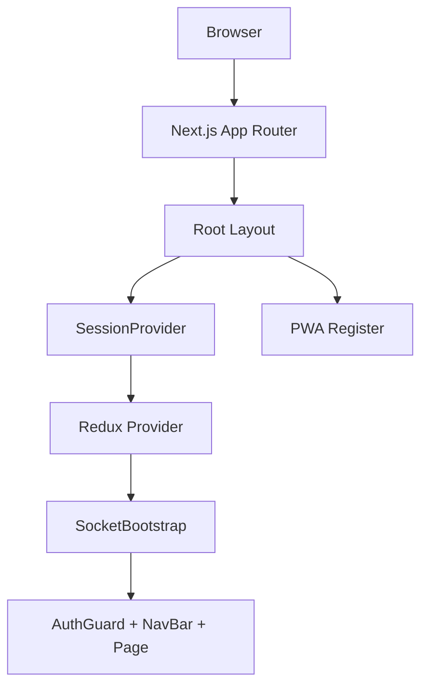
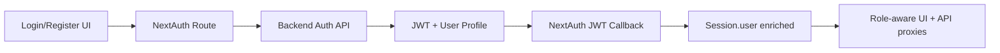
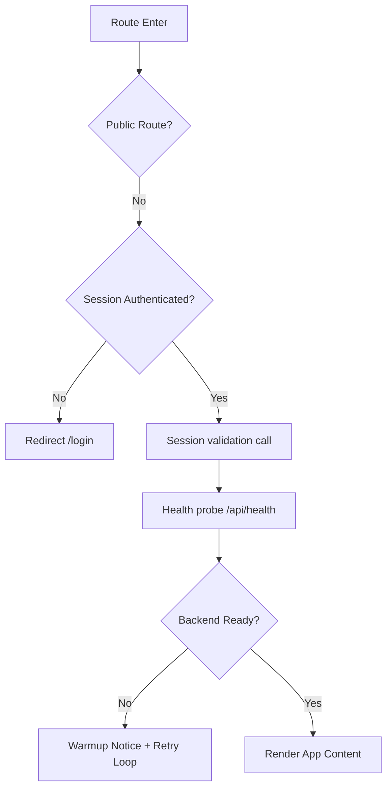
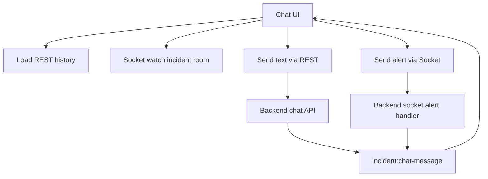
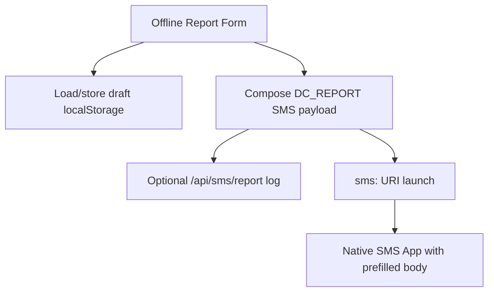
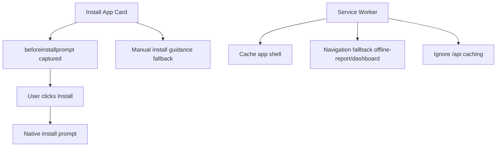

# Frontend Features and End-to-End Flows

This document explains the major frontend features in the Next.js client application, using a feature-heading format with complete flow descriptions and simple architecture diagrams.

## 1) App Shell, Global Providers, and Layout Composition

### Flow
1. The app boots through App Router layout in `src/app/layout.js`.
2. Global styling and map dependencies are loaded (`globals.css`, Leaflet CSS, marker-cluster styles).
3. The provider stack wraps the whole app via `src/app/Provider.js`:
   - `SessionProvider` for NextAuth session context.
   - Redux provider for shared client state.
   - `SocketBootstrap` for authenticated realtime connection lifecycle.
4. Shared UI infrastructure is always present:
   - `PwaRegister` registers service worker.
   - `AuthGuard` enforces route/session behavior and backend warmup UX.
   - `NavBar` provides role-aware navigation and location/sync side effects.
5. Root route (`src/app/page.js`) immediately redirects users to `/dashboard`.

### Simple Architecture Diagram


## 2) Authentication, Social Login, and Session Enrichment

### Flow
1. Login/Register UI is rendered by `src/components/SignIn.jsx` in auth pages.
2. Credential login uses NextAuth credentials provider (server route `src/app/api/auth/[...nextauth]/route.js`).
3. Register flow calls client proxy `/api/register`, then auto-signs-in via credentials.
4. Social login buttons trigger `signIn("google")` or `signIn("github")`.
5. On OAuth sign-in callback:
   - Frontend NextAuth route calls backend `/api/auth/oauth`.
   - Backend user profile and token are merged into NextAuth user/jwt/session.
6. Session object is enriched with app-critical fields:
   - `token`, `activeRole`, `roles`, `assignedIncident`, `skills`, `phone`.
7. Logout uses server action `doLogout` to cleanly end NextAuth session.

### Simple Architecture Diagram


## 3) Route Protection and Backend Warmup Handling

### Flow
1. `AuthGuard` checks current pathname against a public route set.
2. If unauthenticated on protected route, user is redirected to `/login`.
3. If authenticated, guard verifies session health by calling `/api/incidents` and handles 401 by sign-out.
4. Guard runs backend readiness probe through `/api/health`:
   - Displays warmup countdown notice if backend is unavailable.
   - Polls health every 5 seconds.
   - Shows recovery toast once backend is online.
   - Stores ack in sessionStorage to avoid repeated warmup banners.
5. Result: app remains user-friendly during cold starts and session edge cases.

### Simple Architecture Diagram


## 4) API Proxy Layer and Token Forwarding Pattern

### Flow
1. Browser UI never directly calls backend base URL from components.
2. UI calls Next.js route handlers under `src/app/api/**`.
3. Each API route handler:
   - Reads NextAuth session with `auth()`.
   - Extracts backend token from `session.user.token`.
   - Forwards request to backend using `resolveBackendBaseUrl()`.
   - Adds `Authorization: Bearer <token>` where required.
   - Returns backend payload/status with consistent pass-through behavior.
4. Specialized proxy behavior exists where needed:
   - Map feed route includes fallback aggregation mode when backend map endpoint fails.
   - Health route has timeout and standardized 503 payload.
5. This creates a secure BFF-style edge between UI and backend.

### Simple Architecture Diagram
```mermaid
flowchart LR
    A[React Component] --> B[/api/* Next Route Handler]
    B --> C[auth() session lookup]
    C --> D[Attach Bearer token]
    D --> E[Backend REST API]
    E --> F[Payload + status]
    F --> A
```

## 5) Incident Feed and Victim Incident Creation Workspace

### Flow
1. `src/app/incidents/page.jsx` loads assigned incident state first.
2. If role is non-admin and user already has active assignment:
   - Page switches to locked assigned-incident view.
   - Normal multi-incident feed/actions are restricted.
3. If unlocked:
   - Lists incidents with filters (`severity`, `status`) and pagination.
   - Supports realtime refresh on incident socket events.
4. Incident creation panel:
   - Enabled primarily for victim role.
   - Requires valid geolocation from `useCurrentLocation`.
   - Sends POST to `/api/incidents` with title/description/category/severity/location.
   - Navigates to incident workspace on success.
5. Join button logic is assignment-aware and blocks joining other incidents when user is already assigned elsewhere.

### Simple Architecture Diagram
```mermaid
flowchart TD
    A[Incidents Page Load] --> B[Fetch assignedOnly incident]
    B --> C{Assigned + non-admin?}
    C -- Yes --> D[Show locked assigned incident view]
    C -- No --> E[List incidents + filters]
    E --> F[Create/Join actions]
    F --> G[/api/incidents proxy]
    G --> H[Backend incidents service]
    H --> I[Navigate to incident detail]
```

## 6) Incident Detail, Participant Visibility, and Admin Assignment Controls

### Flow
1. `src/app/incidents/[incidentId]/page.jsx` loads:
   - Incident details.
   - Current assignment snapshot.
   - Participants (when authorized).
2. UI computes role/capability flags:
   - Participant/creator/admin checks.
   - `canJoin`, `canResolve`, `canForceClose`, member visibility.
3. Mutations are routed through incident proxy endpoints:
   - Join, resolve, force-close.
   - Assign and unassign participant.
4. Admin-only volunteer assignment flow:
   - Fetches available volunteers from dedicated endpoint.
   - Supports inline assignment from picker.
5. Socket `incident:changed` / `incident:closed` triggers refetch and keeps workspace synchronized.
6. UI shows explicit lifecycle message when auto-close occurs because no victims remain.

### Simple Architecture Diagram
```mermaid
flowchart LR
    A[Incident Detail Page] --> B[Load incident + participants]
    B --> C[Compute role permissions]
    C --> D[Action buttons]
    D --> E[/api/incidents/:id/* proxies]
    E --> F[Backend participation/resolve]
    F --> G[Socket incident changed]
    G --> A
```

## 7) Realtime Chat and Role-Based Quick Alerts

### Flow
1. Chat workspace (`src/app/incidents/[incidentId]/chat/page.jsx`) loads incident and chat history.
2. It verifies assignment access and redirects to incidents page if access is lost or incident is closed.
3. On socket connect:
   - Joins incident room via watch event.
   - Subscribes to chat and alert events.
4. Text messages:
   - Sent via REST proxy `/api/incidents/:id/chat`.
   - Appends optimistic/created message and receives realtime fan-out.
5. Quick alerts:
   - Alert options are role-specific (victim, volunteer, admin sets differ).
   - Sent via socket `sendAlert` event.
   - Server emits structured alert and chat-message events back.
6. UI behavior:
   - Distinct alert rendering with severity styling.
   - Toast notifications for incoming messages/alerts/errors.

### Simple Architecture Diagram


## 8) Live Map Intelligence and Participant Tracking

### Flow
1. Map page (`src/app/map/page.jsx`) loads `/api/incidents/map-feed`.
2. System supports two modes:
   - Global mode: all active incidents + self marker.
   - Assigned mode: assigned incident, self location, participant locations/presence.
3. Data refresh model:
   - Initial fetch.
   - Socket-triggered fetch on incident lifecycle events.
   - Periodic polling every 15 seconds for resilience.
4. Live participant updates:
   - Subscribes to `incident:participant-location` socket events.
   - Merges live updates with feed snapshot.
5. Marker rendering and UX:
   - Clustering, overlap spreading, role-based marker color coding.
   - Toggle filters (incident/self/victim/volunteer/admin).
   - Popup details + external routing links (Google Maps/OpenStreetMap) in isolated tabs/windows.
6. Presence panel shows sharing vs not-sharing participants with last update recency.

### Simple Architecture Diagram
```mermaid
flowchart LR
    A[Map Page] --> B[/api/incidents/map-feed]
    B --> C[Backend map feed]
    A --> D[Socket participant-location]
    C --> E[Base markers]
    D --> F[Live marker overrides]
    E --> G[Filtered clustered map]
    F --> G
    G --> H[External route links]
```

## 9) Offline Report Workflow and SMS Drafting

### Flow
1. Offline report page (`src/app/offline-report/page.jsx`) is designed for low-connectivity reporting.
2. Draft fields are persisted to localStorage for resilience across reloads.
3. Page builds a structured SMS template (`DC_REPORT`) containing:
   - Type, reference, sender, email, location, details.
4. User can:
   - Copy SMS draft to clipboard.
   - Open native SMS app using `sms:` URI with prefilled message.
5. If authenticated, app also attempts best-effort backend log call (`/api/sms/report`) before opening SMS app.
6. Offline mode toggle is shared through `useOfflineMode` hook and localStorage event syncing.

### Simple Architecture Diagram


## 10) Profile Management, Role Switching Rules, and Admin Utilities

### Flow
1. Profile page reads session identity and role context.
2. User profile controls:
   - Phone number normalization and update via `/api/update`.
   - Skill add/remove list and save via `/api/update`.
   - Active role switch via `/api/update`.
3. Role switching guardrails:
   - Disabled when user is assigned to an active incident.
4. Session update callback keeps frontend role/skills/phone synchronized immediately after save.
5. Admin-only utilities:
   - Clear database (`/api/admin/clear-db`) with backend confirmation workflow.
   - Manual SMS test sender (`/api/admin/sms-test`).

### Simple Architecture Diagram
```mermaid
flowchart LR
    A[Profile UI] --> B[/api/update proxy]
    B --> C[Backend user update]
    C --> D[Updated user payload]
    D --> E[NextAuth session update()]
    E --> A
    A --> F[Admin tools]
    F --> G[/api/admin/clear-db or /api/admin/sms-test]
```

## 11) PWA Install Experience and Service Worker Caching

### Flow
1. `PwaRegister` registers service worker (`/sw.js`) on client load.
2. Install UX is explicit via dashboard `InstallAppCard` button:
   - Captures `beforeinstallprompt` event.
   - Triggers prompt only when user clicks Install.
   - Shows manual install guidance when native prompt unavailable.
3. Manifest (`public/manifest.webmanifest`) configures standalone install mode and start URL (`/offline-report`).
4. Service worker behavior:
   - Caches app shell routes/assets.
   - Cleans old caches on activation.
   - Uses network-first for navigation with offline fallback (`/offline-report`, `/dashboard`, `/`).
   - Uses cache-first fallback for static GET assets.
   - Skips API route caching to avoid stale API data.

### Simple Architecture Diagram


---

# Detailed Presentation Explanation (Speaker Notes)

Use this as a presentation script.

## Presentation Narrative

Our frontend is built as a role-aware command interface on top of Next.js App Router. It is not just a page collection; it is a coordinated UI runtime that combines authentication, secured API proxying, realtime sockets, map intelligence, and offline SMS-first workflows.

At startup, the app composes global providers for session, Redux, and sockets. The AuthGuard sits at the shell level and protects routes while also handling backend cold-start behavior with a user-friendly warmup notice and retry loop.

Authentication is unified through NextAuth with credentials and social providers. After successful login, backend identity fields such as role, assignments, skills, and token are merged into session state so all pages can make role-aware decisions immediately.

All browser-to-backend traffic is routed through Next API handlers under `/api/*`. This gives us a clean BFF-style layer where tokens are attached server-side and backend errors are normalized before the UI consumes them.

The incident workspace is the operational core. Users can create incidents, join/leave, assign/unassign, and resolve incidents, but only according to role and assignment rules. The UI reflects those constraints directly, preventing invalid actions before they reach backend validation.

Realtime collaboration is implemented through Socket.IO. Incident chat and quick alerts are synchronized in near real-time, and alert options are role-specific so signals remain policy-compliant.

The map module provides two experience modes: global monitoring and assigned-incident tracking. It merges REST feed snapshots with live participant location events, then visualizes role-specific markers with filtering, clustering, overlap handling, and external navigation links.

For unreliable connectivity, the offline-report feature composes structured SMS payloads and opens the native SMS app directly. This is reinforced by PWA support, explicit install UX, and service worker caching with safe offline fallbacks.

Finally, profile and admin controls complete the operational loop by enabling phone/skills/role updates, SMS test operations, and controlled database reset from the UI.

## Suggested Demo Sequence

1. Start at dashboard and explain provider stack, role briefing, and install card.
2. Show login flow (credentials + social) and session-aware nav.
3. Open incidents page, create incident, and show assignment lock behavior.
4. Enter incident detail, show participant panels and admin assignment controls.
5. Open chat workspace and trigger quick alerts.
6. Open map page and demonstrate live markers and participant presence states.
7. Switch to offline-report and show SMS draft + open SMS app behavior.
8. Open profile page, update phone/skills/role, then show admin utilities.

## Key Value Points to Emphasize

1. Role-aware UX with lifecycle-safe action gating.
2. Backend-secured proxy architecture from frontend edge routes.
3. Reliable realtime incident collaboration through sockets.
4. Strong map situational awareness with live participant tracking.
5. Practical offline continuity via SMS-first reporting and PWA fallback.
6. Operational completeness with profile sync and admin tools.
